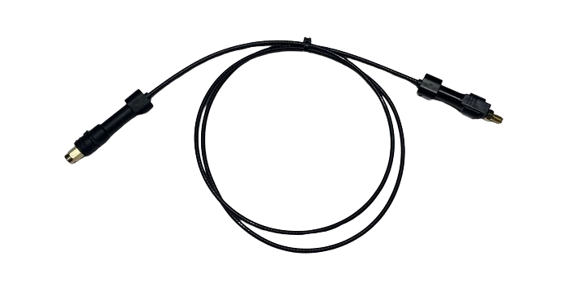
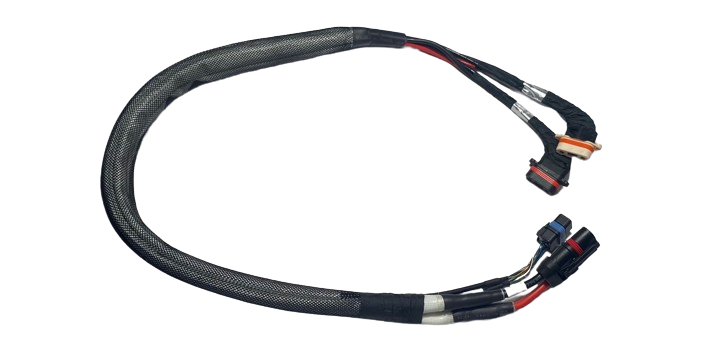
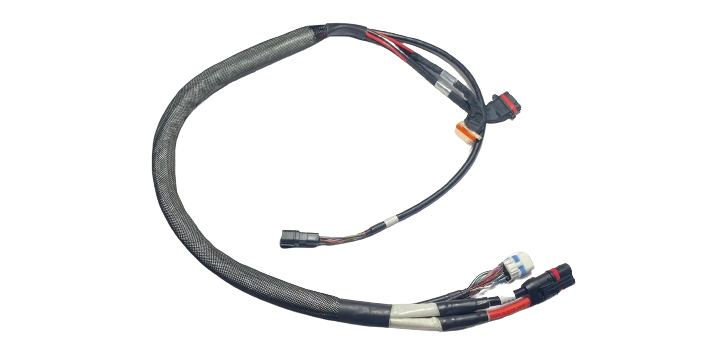
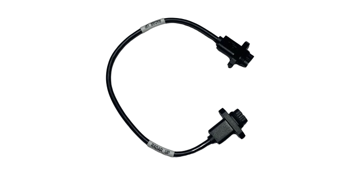
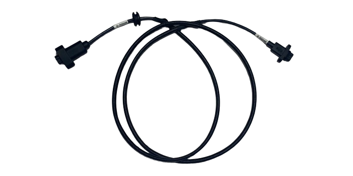
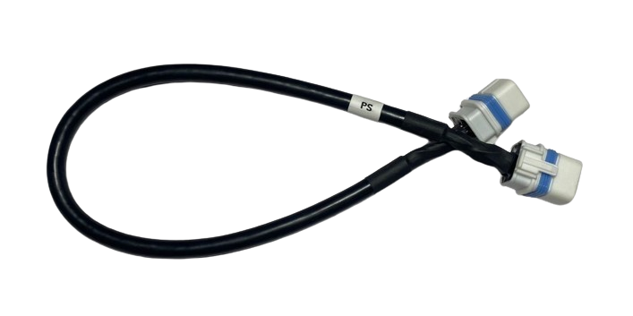
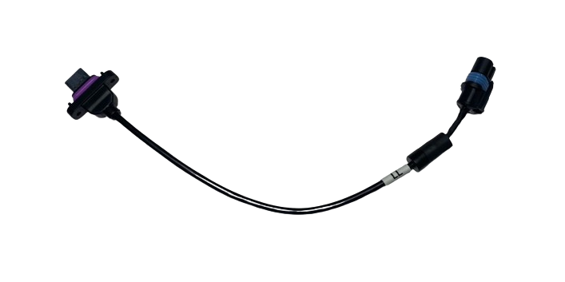
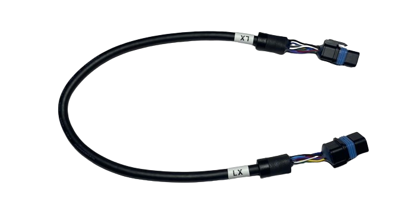
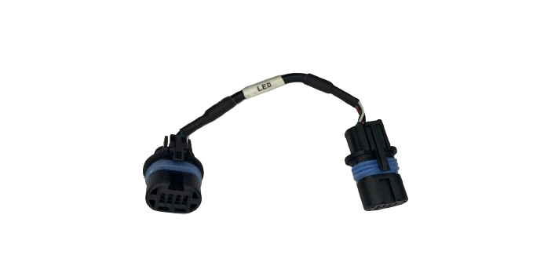

# Cables

| Imagen | Código & Descripción |
| ------ | -------------------- |
|  |YC.XC.DD000501  Front Aircraft Arm ESC Power Adapter Cable Cable de Potencia de los ESCs Delanteros |
|  |YC.XC.XX000840  Signal Cable Cable de Señal |
|  |YC.XC.TT000104  RTK Coaxial Cable Cable Coaxial RTK |
|  |YC.XC.XS000011  M1 & M2 Aircraft Arm ESC Composite Cable Cable Compuesto de los ESCs de los Brazos de la Aeronave M1 & M2 |
|  |YC.XC.XS000012  M3 & M4 Aircraft Arm ESC Composite Cable Cable Compuesto de los ESCs de los Brazos de la Aeronave M3 & M4 |
|  |YC.XC.XX000844  Omnidirectional Radar Signal Cable Cable de Señal del Radar Omnidireccional |
|  |YC.XC.XX000845  Backward Vision Radar Signal Cable Cable de Señal del Radar de Visión Trasera |
|  |YC.XC.XX000842  Spraying Adaptive Cable Cable Adaptivo de Rociado |
|  |YC.XC.XX000835  Spraying Signal Cable Cable de Señal de Rociado |
|  |YC.XC.XX000857  Impeller Pump Signal Cable Cable de Señal de las Bombas de Impulsor |
|  |YC.XC.XX000839  Flow Meter Signal Cable Cable del Caudímetro |
|  |YC.XC.XX000841  Centrifugal Sprinkler Signal Cable Cable del Motor de Boquilla Centrífuga |
|  |YC.XC.XX000853  Auxiliary Bottom Light Signal Cable Cable de Señal de la Luz Auxiliar |
