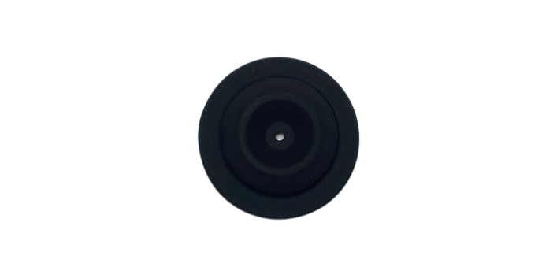
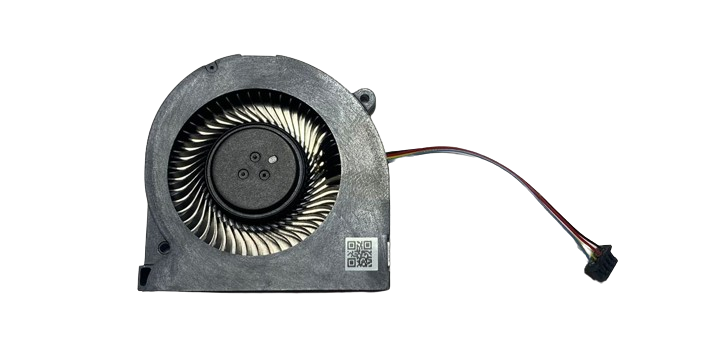

# Control Remoto

Partes y Piezas del Control Remoto.

| Imagen | Código & Descripción |
| ------ | -------------------- |
|  |YC.DZ.AA000253  External RC Antenna Antena Externa del Control Remoto |
|  |BC.AG.SS000585  Right Control Stick Module Módulo del Joystick Derecho |
|  |BC.AG.SS000586  Left Control Stick Module Módulo del Joystick Derecho |
|  |YC.JG.ZS001885  Control Stick Protective Ring Anillo Protector del Joystick |
|  |YC.JG.MY000594  Control Stick Cover Cubierta Protectora del Joystick |
|  |YC.DZ.AF000066  Fan Ventilador del Control Remoto |
|  |    |
