

# Estructuras

Carcasas, cubiertas, protectores, partes del tren de aterrizaje, brazos, partes del chasis, y todo tipo de parte o pieza cuyo propósito principal sea soportar o cubrir alguna otra parte o pieza.

| Imagen | Código & Descripción |
| ------ | -------------------- |
| 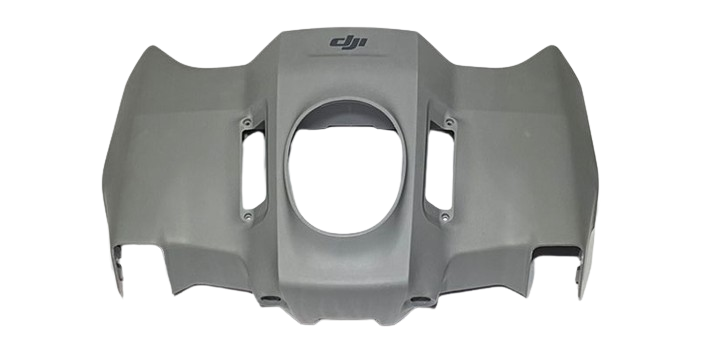 | YC.JG.ZS002282 Front Upper Shell Carcasa Frontal Superior |
| 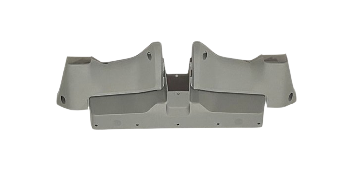 | YC.JG.ZS002283 Front Lower Shell Carcasa Frontal Inferior |
| 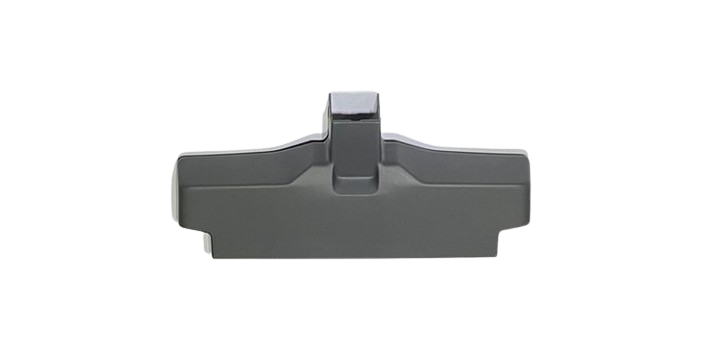 |YC.JG.ZS002432  Front Lower Shell 2 Carcasa Frontal Inferior 2 |
| 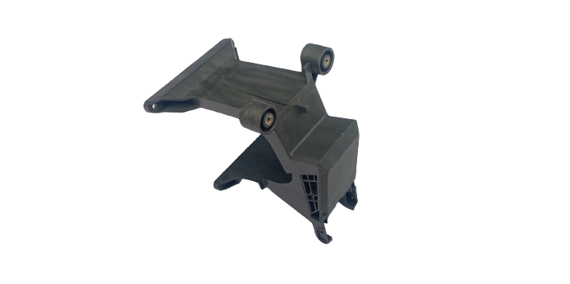 |YC.JG.ZS002279  FPV Bracket Soporte Cámara FPV |
| 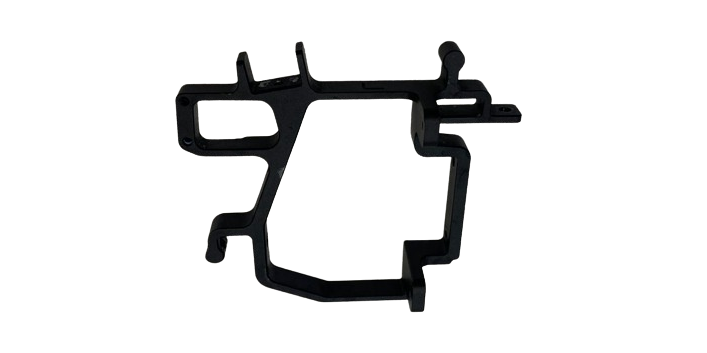 |YC.JG.QX002208  Front Shell Bracket (Right) Soporte de la Carcasa Frontal (Derecho) |
| 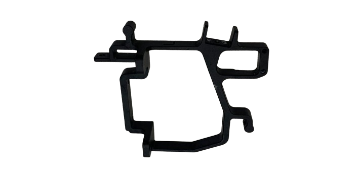 |YC.JG.QX002209  Front Shell Bracket (Left) Soporte de la Carcasa Frontal (Izquierdo) |
| 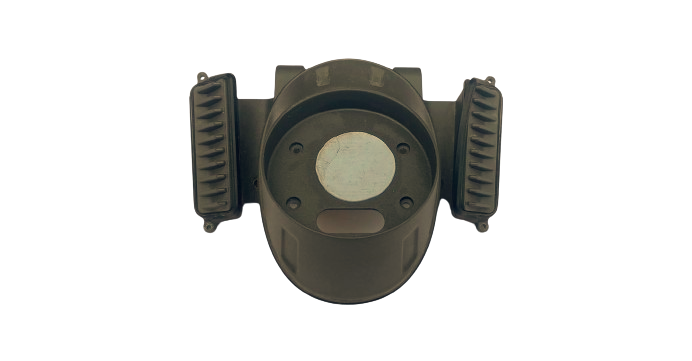 |YC.JG.YZ000498  Omnidirectional Radar Fixing Base Base del Radar Omnidireccional |
| 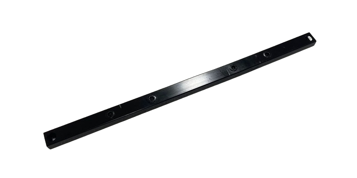 |YC.JG.QX002207  Radar Crossbeam Barra de Soporte del Radar |
| 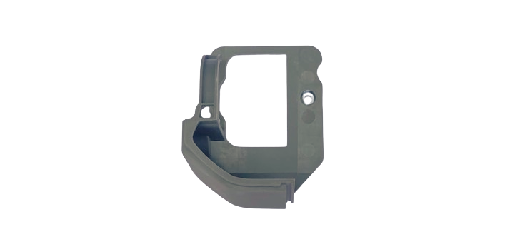 |YC.JG.ZS002415  Front Frame Cable Bracket (Right) Soporte de Cables del Armazón Delantero (Derecho) |
| 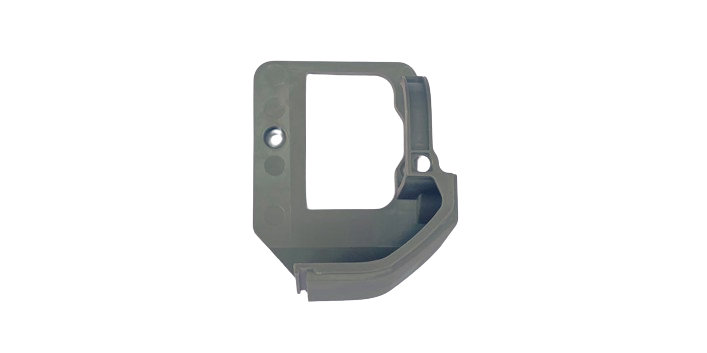 |YC.JG.ZS002476  Front Frame Cable Bracket (Left) Soporte de Cables del Armazón Delantero (Izquierdo) |
| 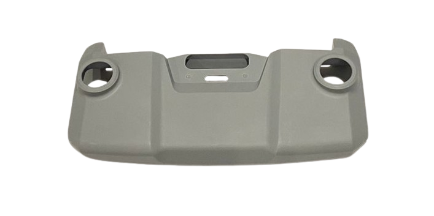 |YC.JG.ZS002298  Rear Upper Cover Carcasa Trasera Superior |
| 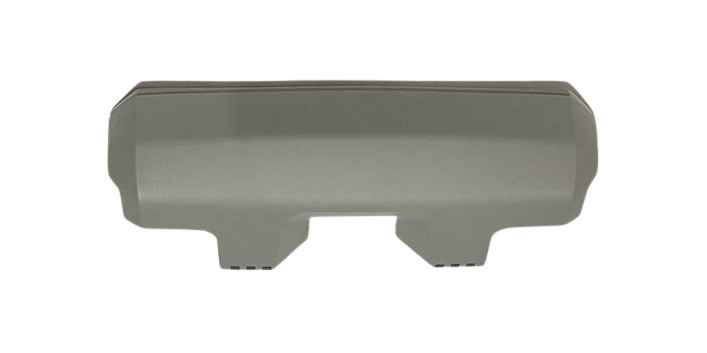 |YC.JG.ZS002299  Rear Lower Cover Carcasa Trasera Inferior |
| 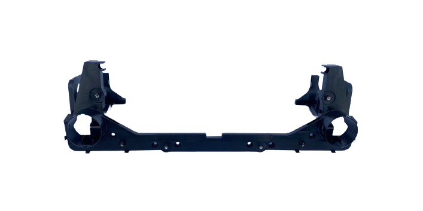 |YC.JG.ZS002222  Real Shell Bracket Soporte de la Carcasa Trasera |
| 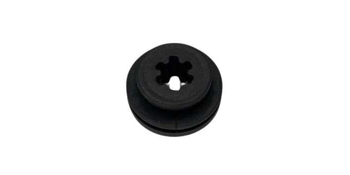 |YC.JG.MY000380  Damping Pad  |
| 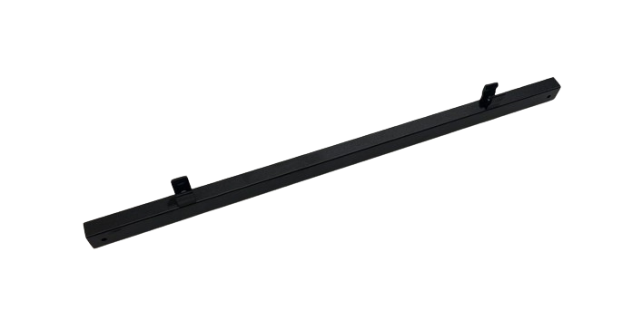 |YC.JG.QX002224  Rear Frame Crossbeam Barra de Soporte Trasera |
| 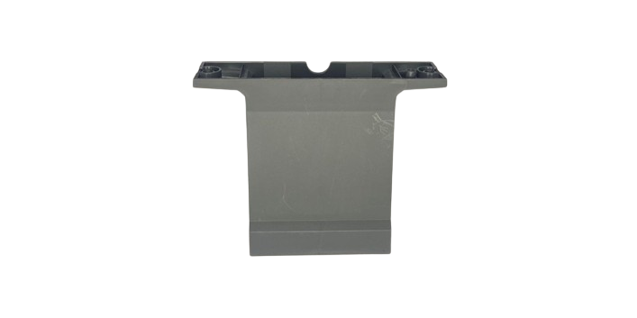 |YC.JG.ZS002284  Downward Vision Radar Bracket Radar Trasero Inferior |
| 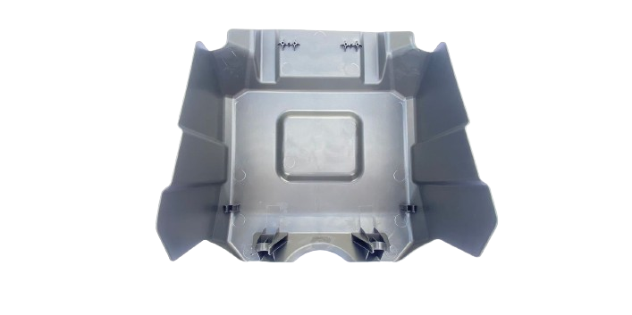 |YC.JG.ZS002307  Spray Tank Outer Shell Carcasa Exterior del Tanque |
| 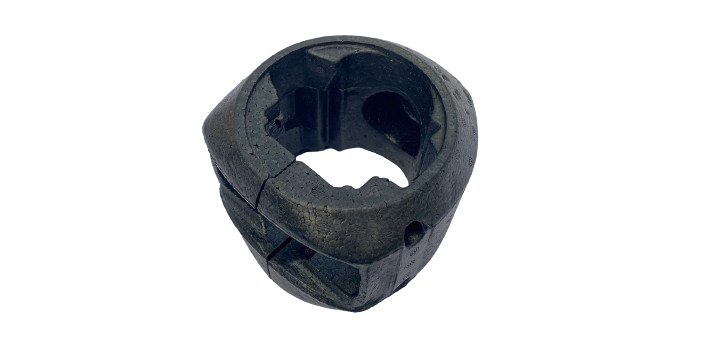 |YC.JG.FP000018  Motor Cover Espuma Protectora del Motor |
| 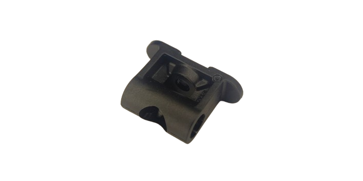 |YC.JG.ZS002422  Outer Shell Buckle Vincha Macho |
| 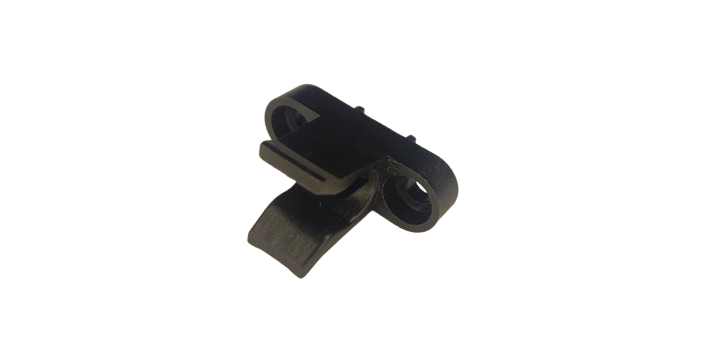 |YC.JG.ZS000998  Rear Shell Small Buckle Base Vincha Hembra |
| 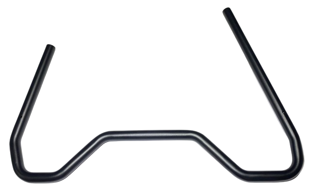 |YC.JG.BJ001168  Landing Gear Aluminum Tube Tubo de Alumiunio del Tren de Aterrizaje |
| 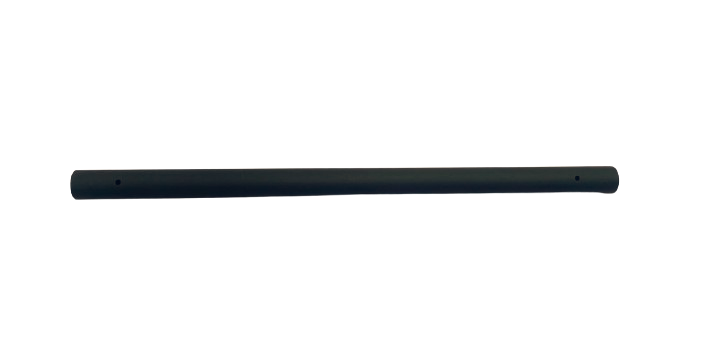 |YC.JG.XW000089  Landing Gear Crossbeam Tubo Cruzado del Tren de Aterrizaje |
|  |YC.JG.ZS002285  Landing Gear Y-tee Part T del Tren de Aterrizaje |
| 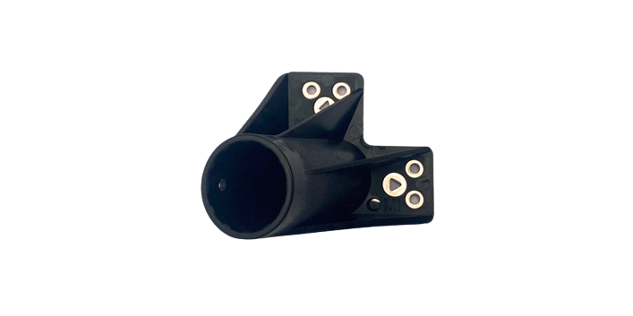 |YC.JG.ZS002187  Landing Gear Fixing Piece M1 Base Tren de Aterrizaje M1 |
| 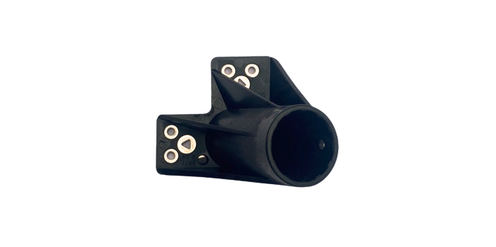 |YC.JG.ZS002188  Landing Gear Fixing Piece M2 Base del Tren de Aterrizaje M2 |
| 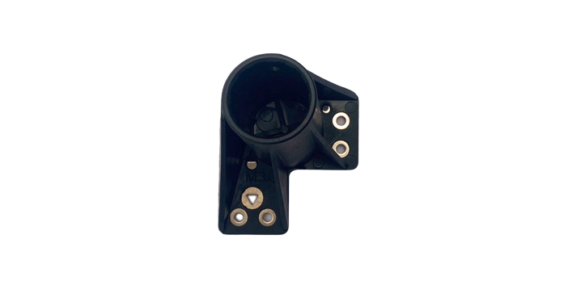 |YC.JG.ZS002189  Landing Gear Fixing Piece M3 Base del Tren de Aterrizaje M3 |
| 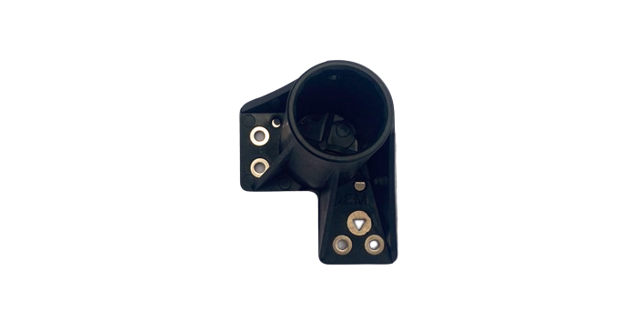 |YC.JG.ZS002190  Landing Gear Fixing Piece M4 Base del Tren de Aterrizaje M4 |
| 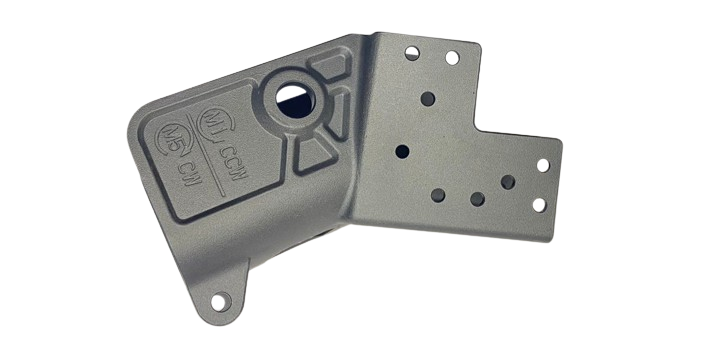 |YC.JG.QX002135  M1 Aircraft Arm Connector Conector del Brazo de la Aeronave M1 |
| 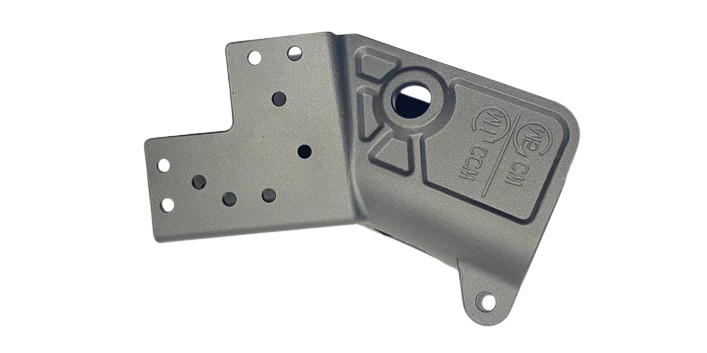 |YC.JG.QX002136  M2 Aircraft Arm Connector Conector del Brazo de la Aeronave M2 |
| 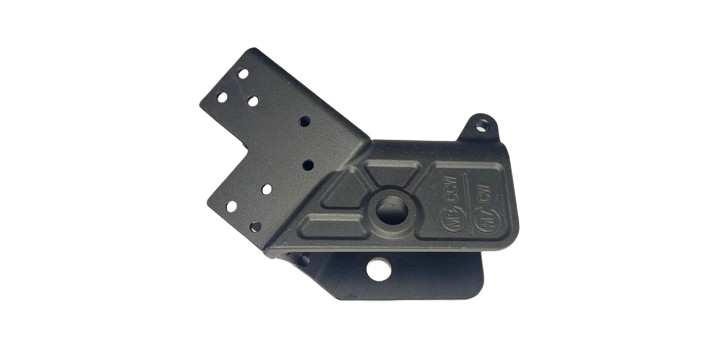 |YC.JG.QX002257  M3 Aircraft Arm Connector Conector del Brazo de la Aeronave M3 |
| 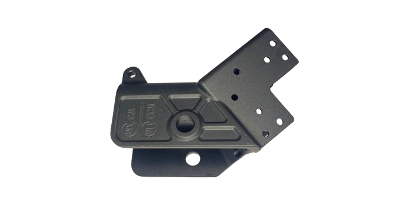 |YC.JG.QX002258  M4 Aircraft Arm Connector Conector del Brazo de la Aeronave M4 |
| 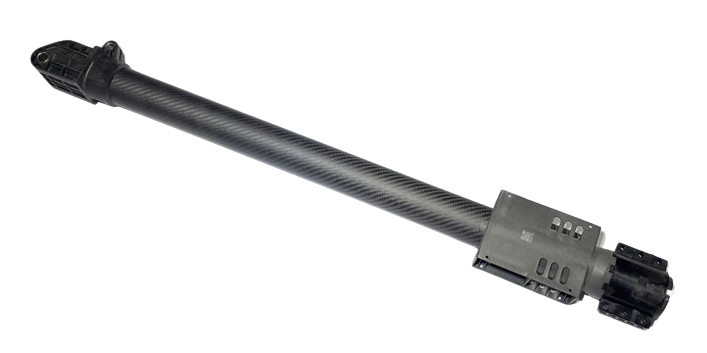 |BC.AG.SS000777  M1 Aircraft Arm (Front Right) Brazo de la Aeronave M1 (Frontal Derecho) |
| 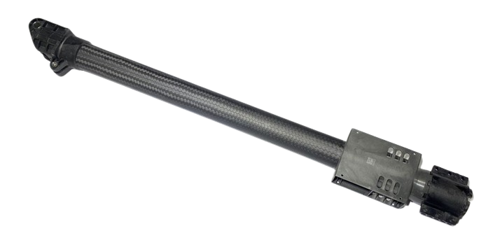 |BC.AG.SS000778  M2 Aircraft Arm (Front Left) Brazo de la Aeronave M2 (Frontal Izquierdo) |
|  |BC.AG.SS000779  M3 Aircraft Arm (Rear Left) Brazo de la Aeronave M3 (Trasero Izquierdo) |
|  |BC.AG.SS000780  M4 Aircraft Arm (Rear Right) Brazo de la Aeronave M4 (Trasero Derecho) |
| 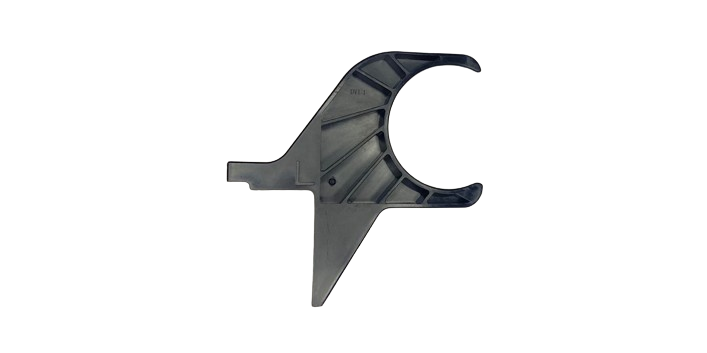 |YC.JG.ZS002191  Aircraft Arm Fixing Piece (Left) Sujetador de Brazos (Izquierdo) |
| 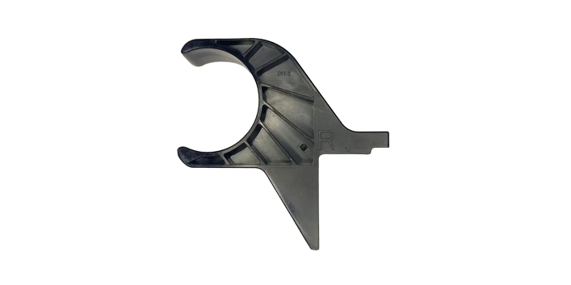 |YC.JG.ZS002192  Aircraft Arm Fixing Piece (Right) Sujetador de Brazos (Derecho) |
|  |YC.JG.ZS003694  Anti-Wear Sleeve Manga Anti-Desgaste |
| 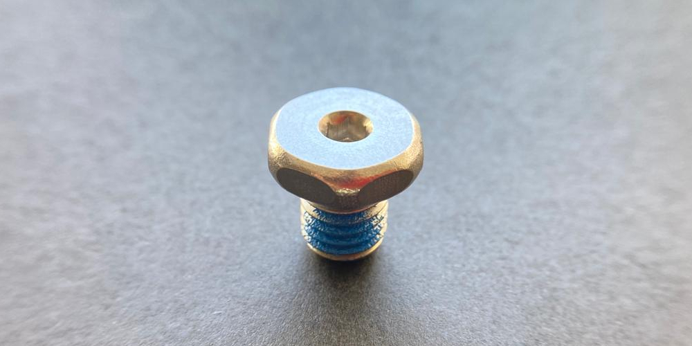 |YC.JG.LD000039  Aircraft Arm Fixing Screw Tornillo del Eje Sujección del Brazo |
|  |YC.JG.QX002314  Aircraft Arm Fixing Screw Bolt Perno del Eje Sujección del Brazo |
| 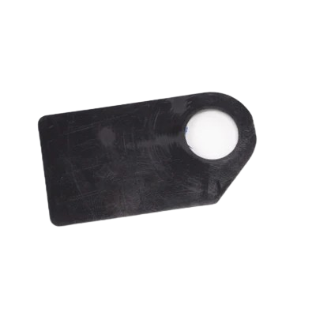 |YC.JG.ZS002394  Aircraft Arm Friction Plate Plato de Fricción del Brazo |
|  |BC.AG.SS000575  Locking Piece Handle Mango del Seguro del Brazo |
|  |YC.JG.LD000041  Locking Piece Fixing Screw Bolt Perno del Mango del Seguro del Brazo |
|  |YC.JG.QX002088  Locking Piece Connection Rod Varilla del Seguro del Brazo |
|  |YC.JG.QX002089  Locking Piece Aircraft Arm Shaft Eje de la Varilla del Seguro del Brazo 1 |
|  |YC.JG.QX001243  Locking Piece Handle Connecting Rod Shaft Eje de la Varilla del Seguro del Brazo 2 |
|  |YC.JG.TT000095  Locking Piece Spring Resorte del Mango del Seguro del Brazo |
| 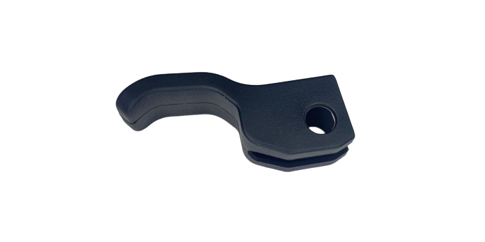 |YC.JG.MY000720  Locking Piece Handle Rubber Sleeve Caucho Cobertor del Seguro del Brazo |
|  |YC.JG.ZS002278  In-Position Detector Bracket Sujetador del Sensor de Plegado |
|  |YC.JG.QX003209  Motor Fixing Base - M4 Upper Base de Motor - M4 Superior |
|  |YC.JG.QX003210  Motor Fixing Base - M4 Lower Base del Motor - M4 Inferior |
|  |YC.JG.QX003454  Motor Fixing Base - M5 UPPER Base del Motor - M5 Superior |
|  |YC.JG.QX003455  Motor Fixing Base - M5 LOWER Base del Motor - M5 Inferior |
| 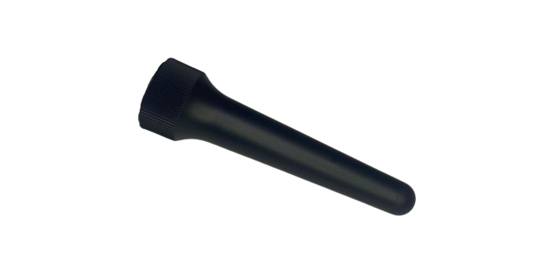 |YC.JG.ZS002416  SDR Protective Sleeve Cobertor de la Antena SDR |
| 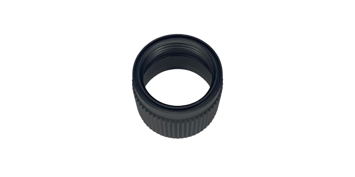 |YC.JG.ZS002262  Spray Rod Fixing Nut Tuerca del Bajante |
| 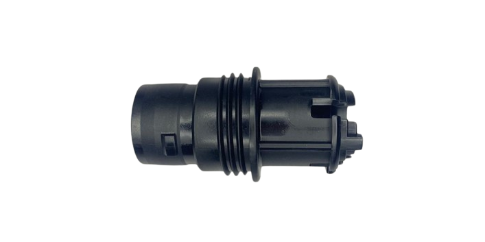 |YC.JG.ZS002253  Spray Rod Adaptive Shaft Eje Adaptivo del Bajante |
|  |YC.JG.ZS002254  Spray Rod Quick-Release Sleeve Acople Rápido del Bajante |
| 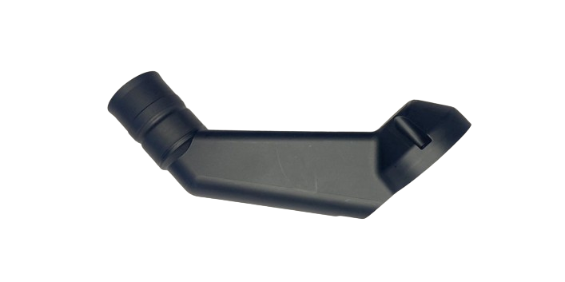 |YC.JG.ZS002483  Centrifugal Spray Boom Bajante |
| 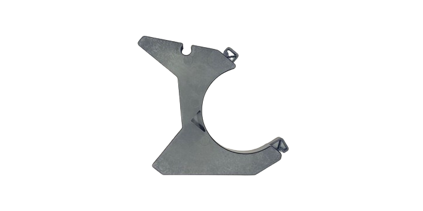 |YC.JG.ZS002234  Impeller Pump Bracket Soporte de la Bomba |
| 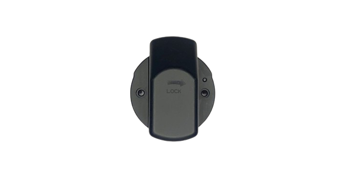 |YC.JG.ZS002389  Impeller Pump Protective Hood Tapa Protectora de Bombas |
| 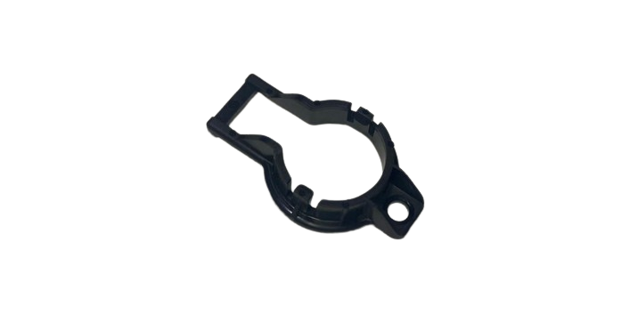 |YC.JG.ZS002237  Liquid Level Meter Bracket Sujetador del Sensor de Nivel de Liquido |
| 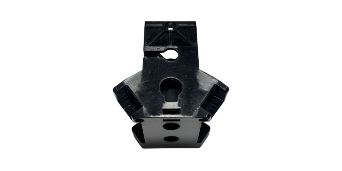 |YC.JG.ZS002224  Load Sensor Bracket (Front) Soporte de la Balanza (Delantero) |
| 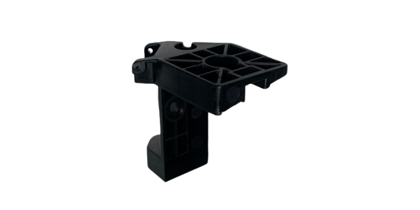 |YC.JG.ZS002225  Load Sensor Bracket (Left) Soporte de la Balanza (Izquierdo) |
| 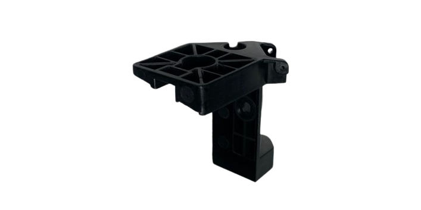 |YC.JG.ZS002226  Load Sensor Bracket (Right) Soporte de la Balanza (Derecho) |
| 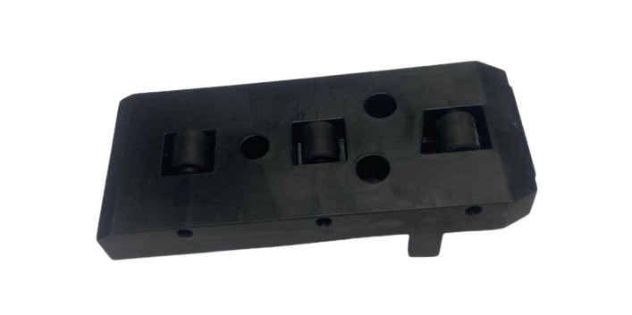 |YC.JG.ZS002294  Battery Supporting Piece (Left) Soporte de la Batería (Izquierdo) |
| 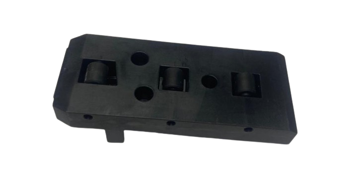 |YC.JG.ZS002295  Battery Supporting Piece (Right) Soporte de la Batería (Derecho) |
| 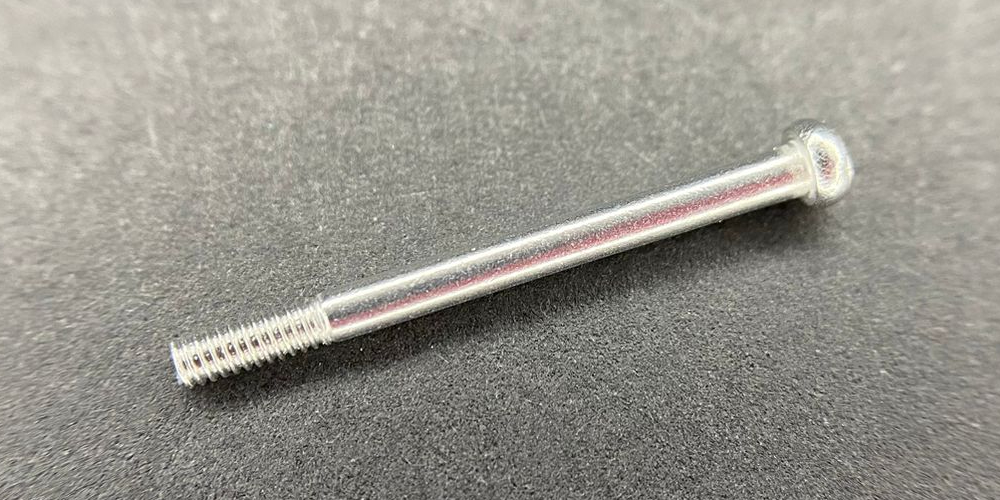 |YC.WJ.ZZ002618  Spray Tank Fixing Piece Roller Shaft Tornillo de Eje del Rodamiento del Sujetador del Tanque de Rociado |
| 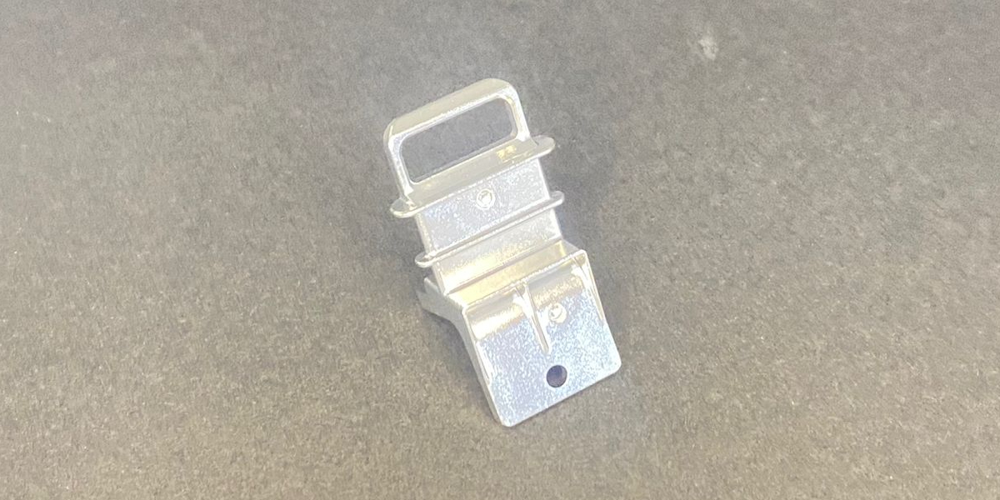 |YC.JG.FM000083  Battery Buckle Seguro de la Batería |
| 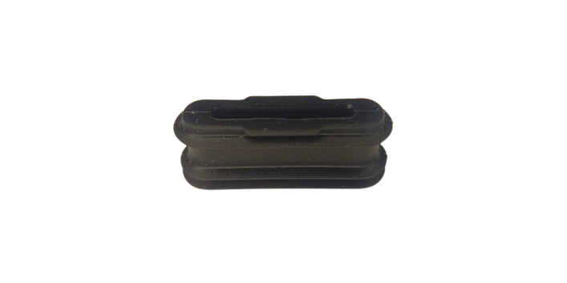 |YC.JG.MY000736  Battery Buckle Sealing Ring Caucho Sellador de la Batería |
| 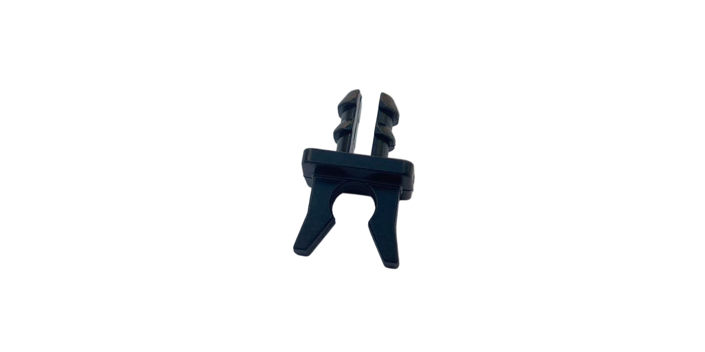 |YC.JG.ZS002229  Load Sensor Cable Clip Clip del Cable de las Balanzas |
| 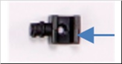 |YC.JG.ZS002259  Hose Clip Clip de la Manguera |
