

# Sistema de Propulsión

Estas partes y piezas juegan un papel fundamental en la generación de sustentación.

| Imagen | Código & Descripción |
| ------ | -------------------- |
| 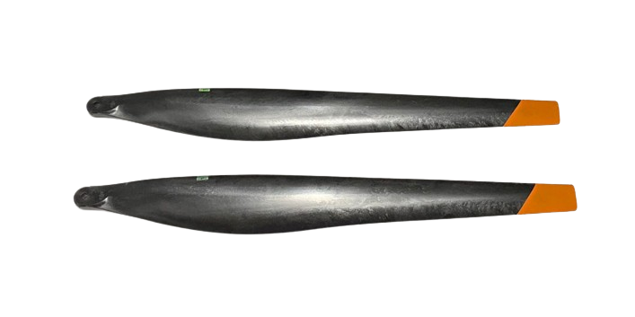 | YC.JG.ZS001963 Propeller U-CCW Hélices U-CCW |
| 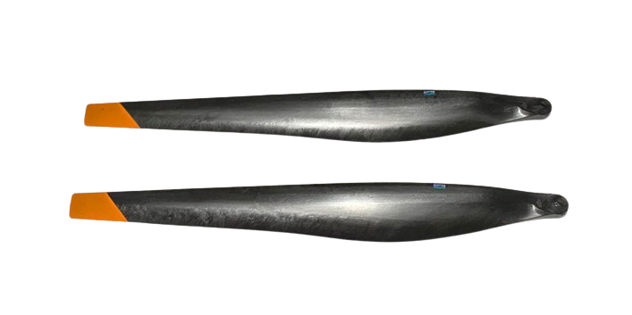 | YC.JG.ZS001964 Propeller U-CW Hélices U-CW  |
| 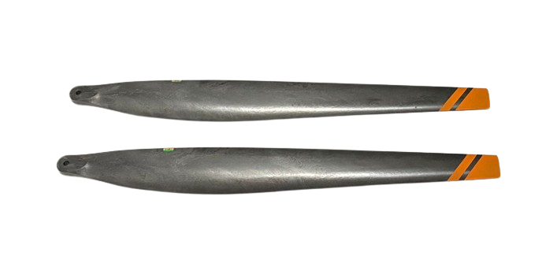 | YC.JG.ZS001965 Propeller L-CCW Hélices L-CCW |
| 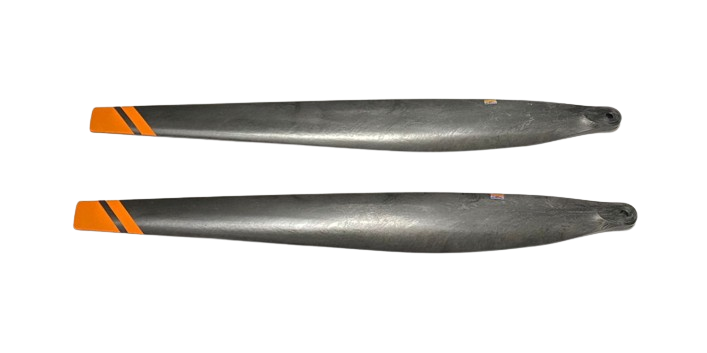 | YC.JG.ZS001966 Propeller L-CW Hélices L-CW |
|  | YC.ST.LL000209 Propeller Clamp Screws Tornillo de Hélice |
| 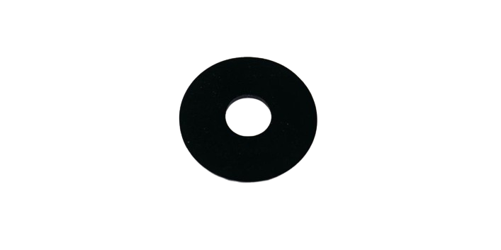 | YC.JG.MQ001280 Propeller Clamp Rubber Pad Anillo de Caucho de Hélice |
| 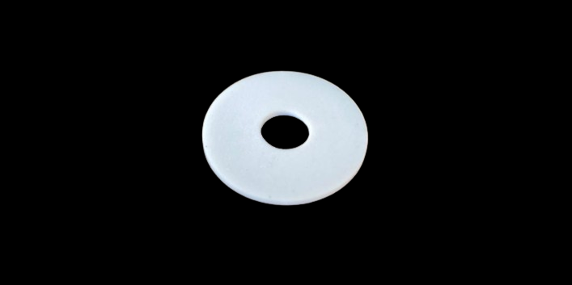 | YC.JG.MQ001292 Propeller Clamp Teflon Pad Anillo de Teflón de Hélice |
| 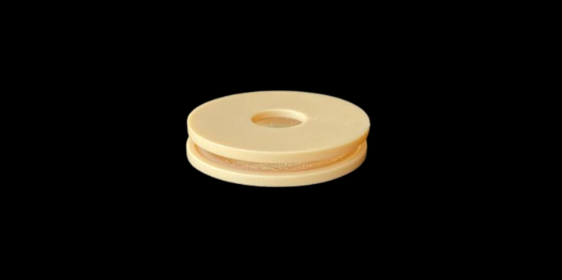 | YC.JG.ZS003829 Propeller Clamp Pad (Sandwich Type) Anillo para Hélice (Tipo Sánduche) |
| 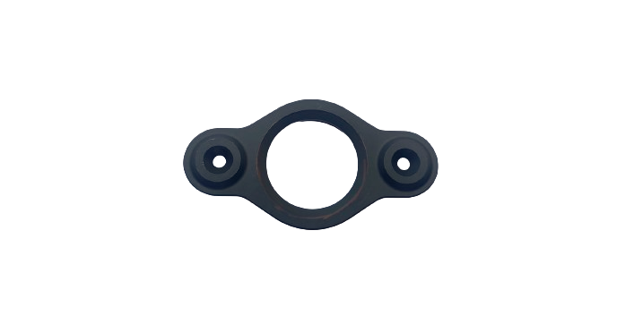 | YC.JG.QX002177 Propeller Clamp Abrazadera de las Hélices |
| 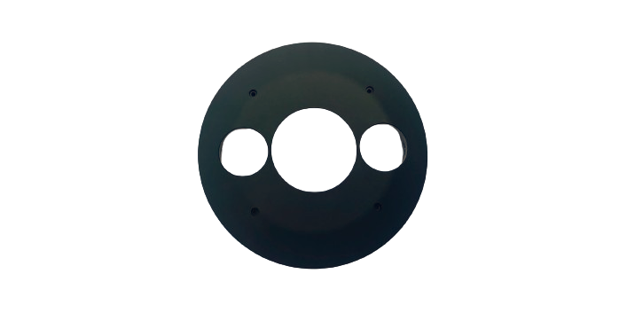 | YC.JG.ZS002379 Motor Upper Cover Tapa de Motor |
| 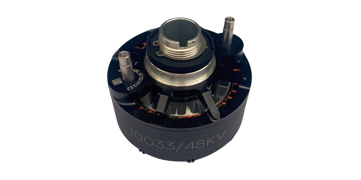 | BC.AG.SS000566 10033 Propulsion Motor - M4 Motor de Propulsión 10033 - M4 |
|  | BC.AG.SS000668 10033 Propulsion Motor - M5 Motor de Propulsión 10033 - M5 |
| 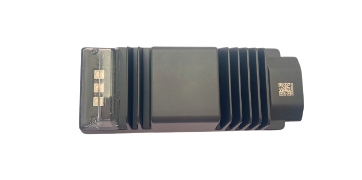 | BC.AG.SS000563 ESC Module Módulo ESC |
