

# Sistema de Rociado

Estas partes y piezas están involucradas en el transporte del líquido pesticida, desde la boca del tanque hasta los discos de rociado.

| Imagen | Código & Descripción |
| ------ | -------------------- |
| 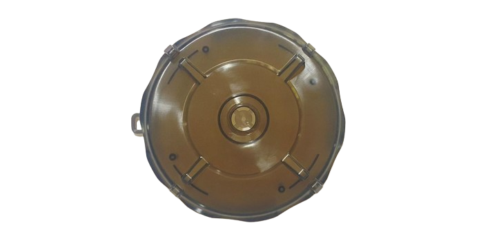 | YC.JG.ZS002251 Spray Tank Cover Tapa del Tanque |
| 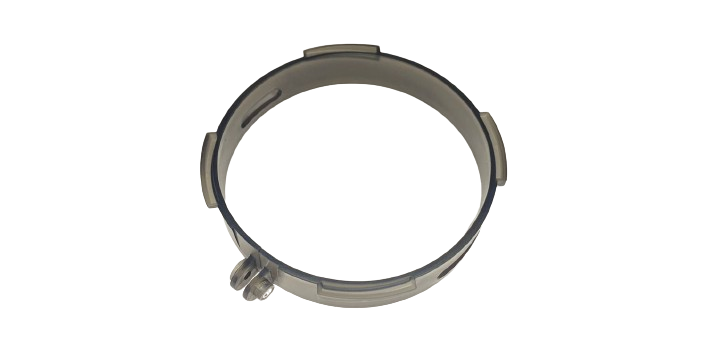 | YC.SJ.WS002423 Spray Tank Cover Ring Anillo Fijador de la Tapa del Tanque |
|  | YC.JG.MY000679 Spray Tank Cover Sealing Ring Anillo Sellador de la Tapa del Tanque |
|  | YC.JG.ZS001085 Spray Tank Inlet Filter Filtro del Tanque |
| 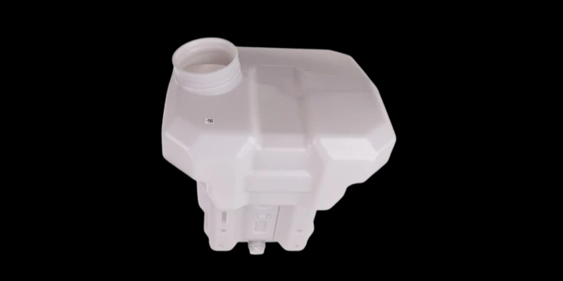 | YC.JG.CS000012 Spray Tank (40L) Tanque de Rociado (40L) |
| 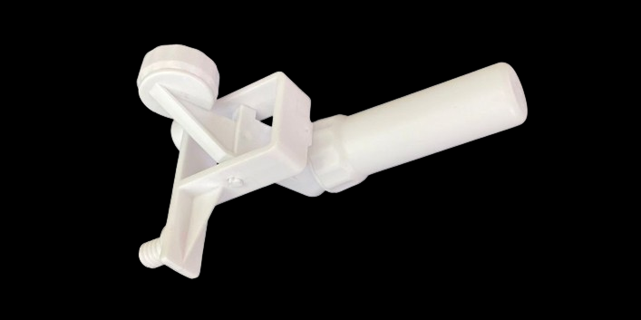 | BC.AG.SS000471 Spray Tank Liquid Level Meter Flotador del Tanque |
| 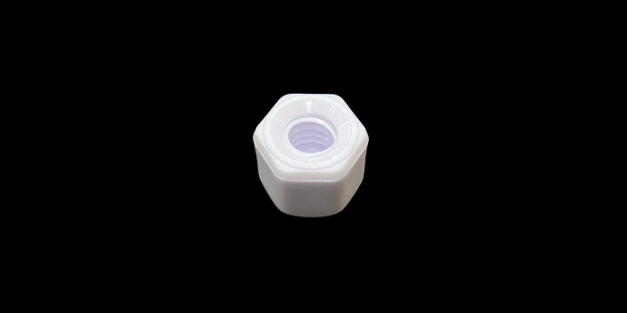 | YC.SJ.WS002412 Spray Tank Liquid Level Meter Installation Nut Tuerca del Flotador del Tanque |
|  | YC.JG.MY000687 Spray Tank Y-tee Part Sealing Ring Anillo Sellador de la T del Tanque |
| 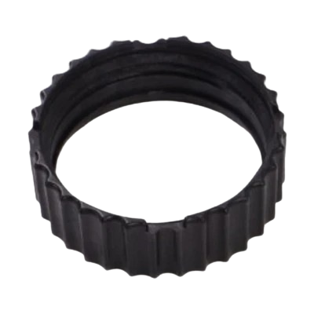 | YC.JG.ZS002233 Water Outlet Rotation Cover Cubierta Rotatoria de la Salida de Agua |
| 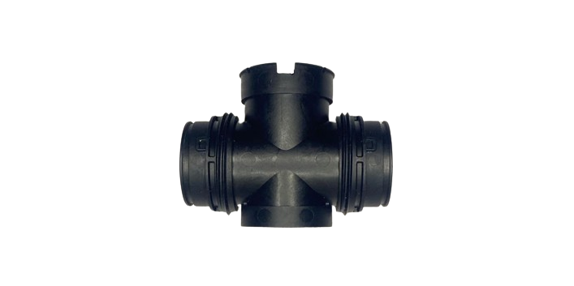 | YC.JG.ZS002232 Spray Tank Y-tee Part Pieza en Forma de T del Tanque |
|  | YC.SJ.J01186 Spray Tank 50-mesh Filter Sealing Ring Anillo Sellador del Filtro del Tanque |
| 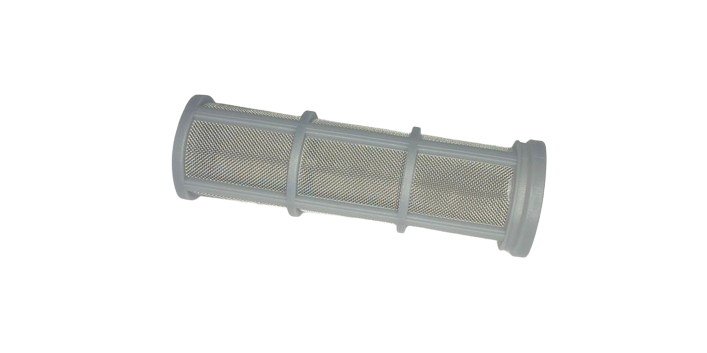 | YC.JG.ZS002429 Spray Tank 50-mesh Filter Filtro del Tanque |
| 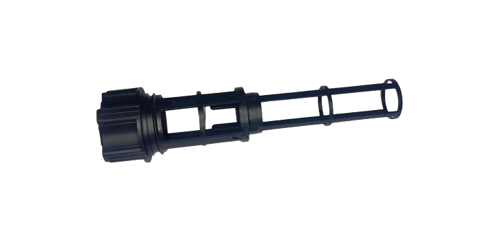 | YC.JG.ZS002235 Spray Tank Quick-Release Filter Filtro de Liberación Rápida del Tanque |
|  | YC.JG.MY000703 Pump Sealing Ring Anillo Sellador de la Bomba |
|  | YC.JG.MY000712 Centrifugal Valve Rubber Pad Anillo Sellador Interno del Motor de Bomba y/o Motor de Boquilla Centrífuga |
|  | YC.JG.MY000704 Motor Sealing Ring Anillo Sellador Externo del Motor de Bomba y/o
Motor de Boquilla Centrífuga |
| 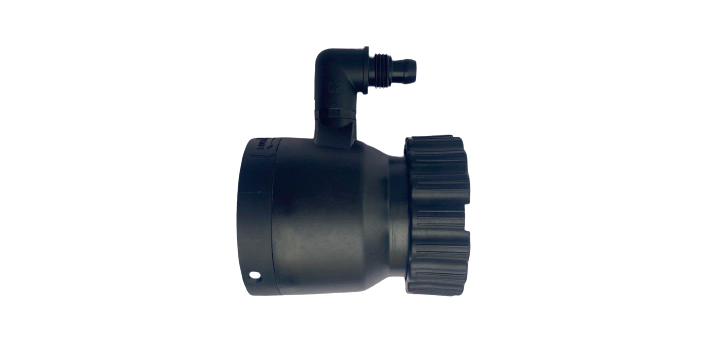 | BC.AG.SS000654 Impeller Pump Module Módulo de Bomba de Impulsor |
|  | YC.XJ.QT000350 Pump Connector Sealing Ring Anillo Sellador del Conector de la Bomba |
| 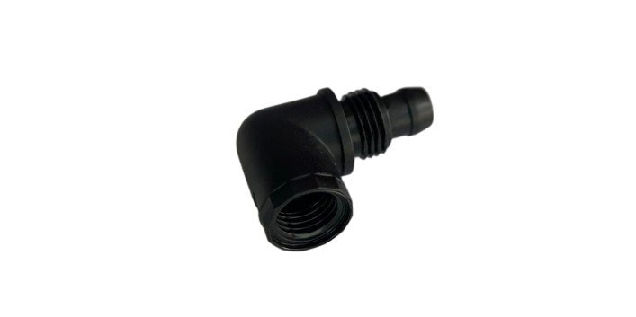 | YC.JG.ZS002348 Impeller Pump Curving Connector Conector Curvo de la Bomba |
| 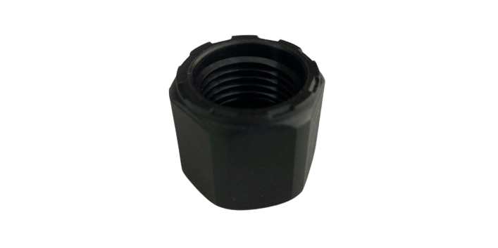 | YC.JG.ZS002255 Hose Nut Tuerca de Manguera |
