

# Sensores & Electrónica

| Imagen | Código & Descripción |
| ------ | -------------------- |
| 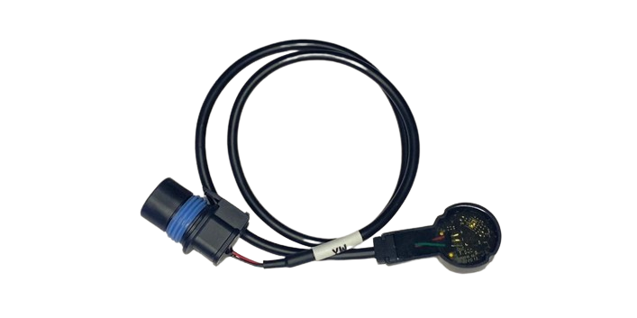 |BC.AG.SS000547  Liquid Level Meter Module Sensor de Nivel de Líquido |
| 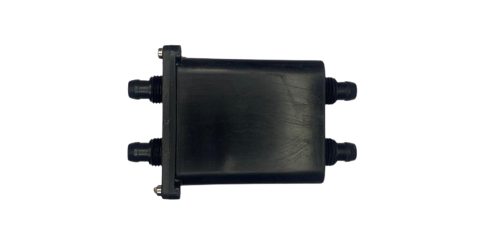 | BC.AG.SS000545 Flow Meter Module Caudímetro |
| 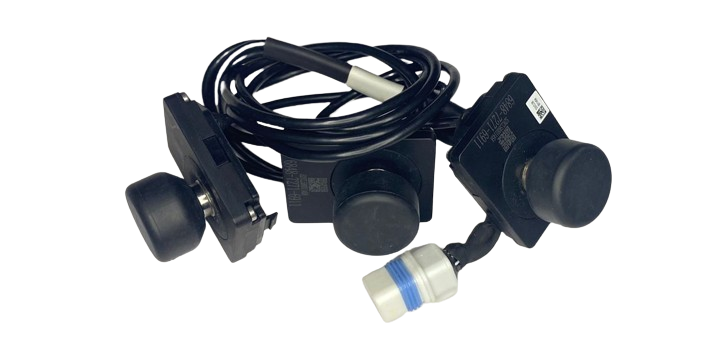 |BC.AG.SS000550  Load Sensor Module Módulo del Sensor de Carga (Balanzas) |
|  |YC.XC.XX000834  Aircraft Arm In-Position Detector Signal Cable Sensor de Plegado |
| 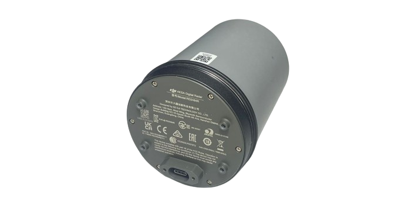 |BC.AG.SS000551  Omnidirectional Radar Module Radar Omnidireccional Frontal |
| 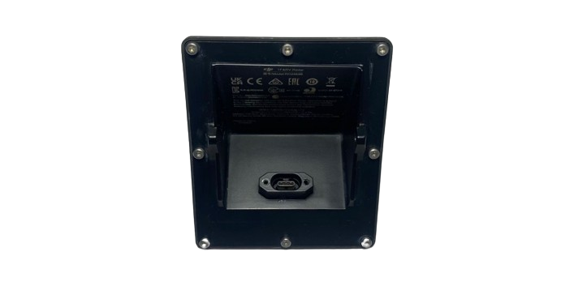 |BC.AG.SS000655  Backward Vision Sensor Radar Module Radar Inferior Trasero |
| 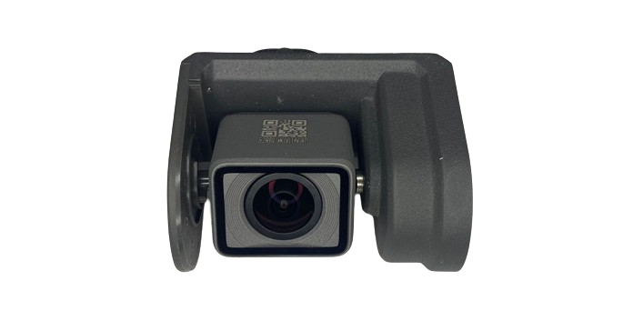 |BC.AG.SS000549  FPV Module Cámara FPV |
| 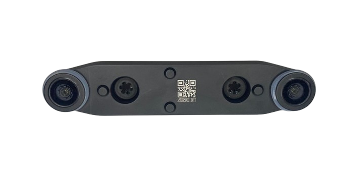 |BC.AG.SS000562  Forward Vision Sensor Module Módulo del Sensor de Visión Frontal |
| 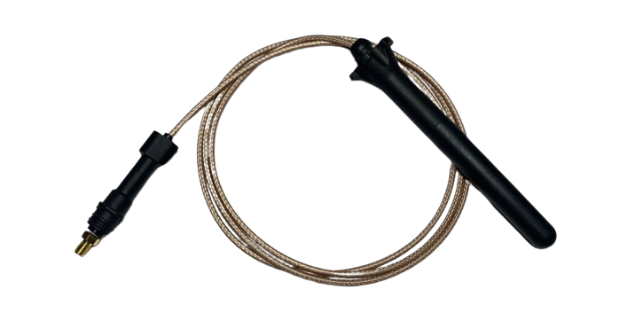 |YC.DZ.AA000275  SDR Antenna Antena SDR del Dron |
| 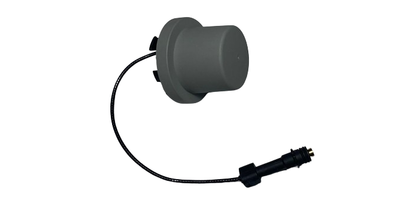 |BC.AG.SS000560  RTK Antenna Module Módulo de Antena RTK |
| 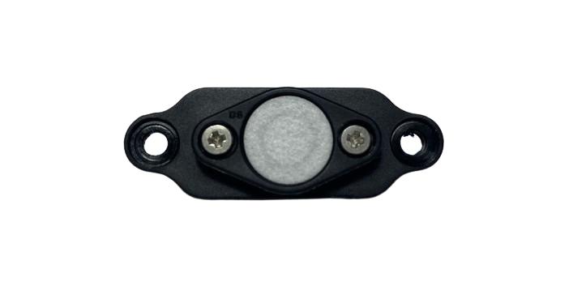 | N/A Barometer Module Barómetro |
| 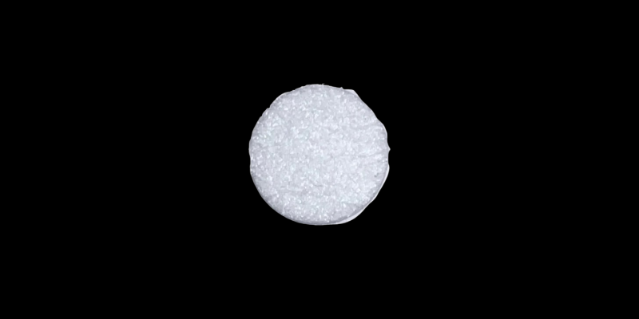 |YC.QT.QT000167  Barometer Waterproof Permeability Film Filtro del Barómetro |
| 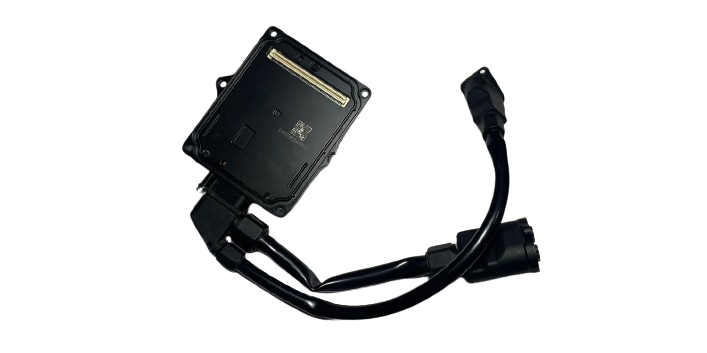 |BC.AG.SS000617  Aerial-Electronics Module (L) Módulo de Electrónica Aérea (L) |
| 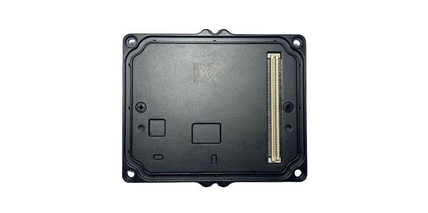 |BC.AG.SS000554  Spraying Board Tarjeta de Rociado |
| 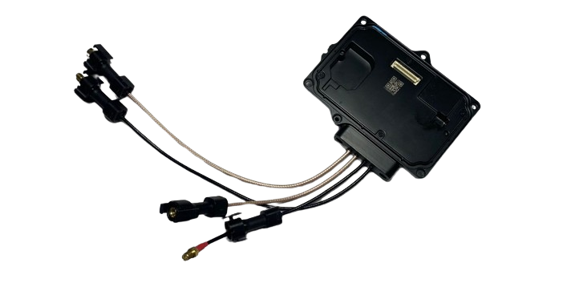 |BC.AG.SS000552  RF Board Tarjeta de Radiofrecuencia |
| 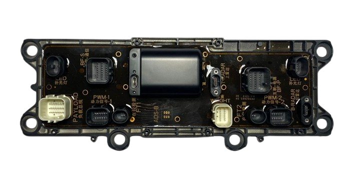 |BC.AG.SS000556  Cable Distribution Board Module Tarjeta de Distribución de Cables |
| 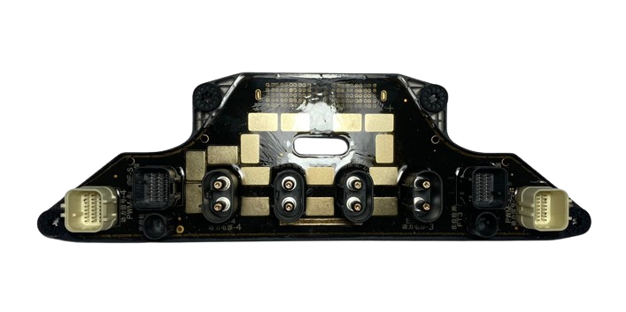 |BC.AG.SS000558  Power Distribution Board Module Tarjeta de Distribución de Potencia |
| 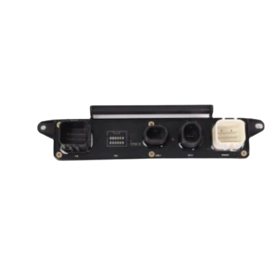 |BC.AG.SS000546  Spraying Adapter Module Tarjeta Adaptadora de Rociado |
|  |BC.AG.SS000548  Auxiliary Bottom Light Module Módulo de la Luz Auxiliar |
