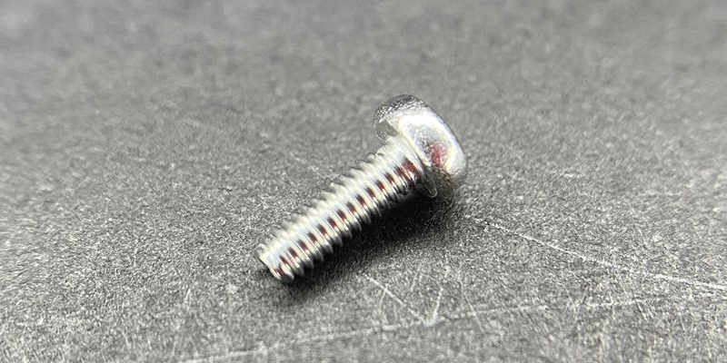
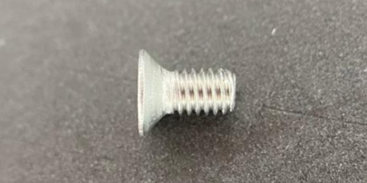
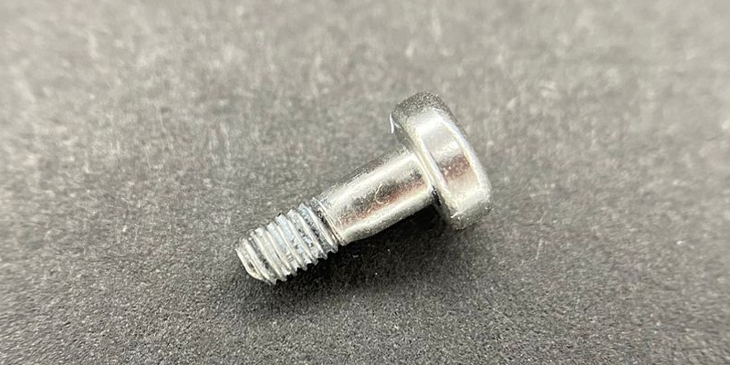
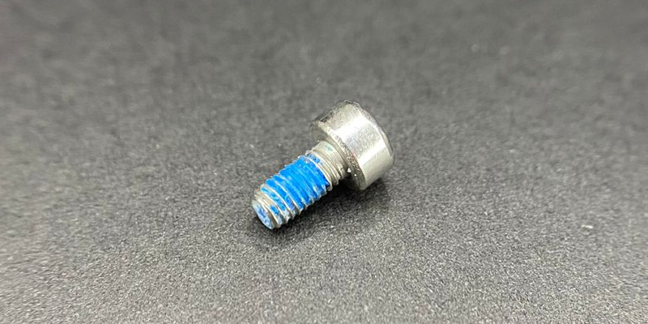
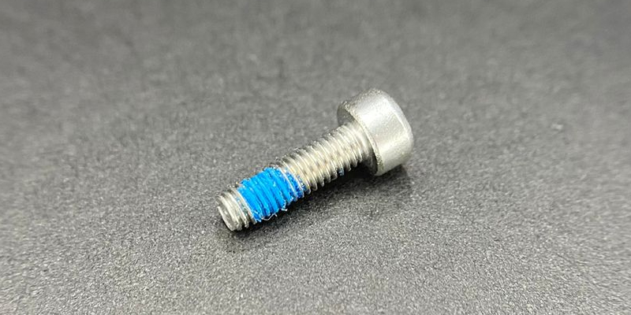
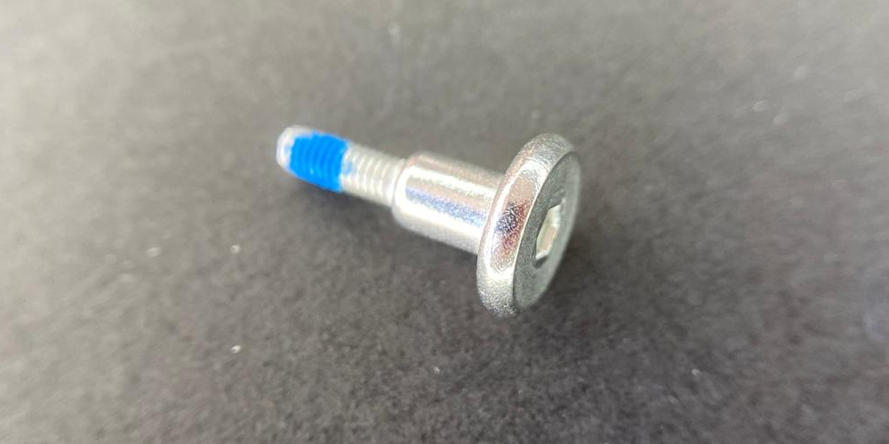
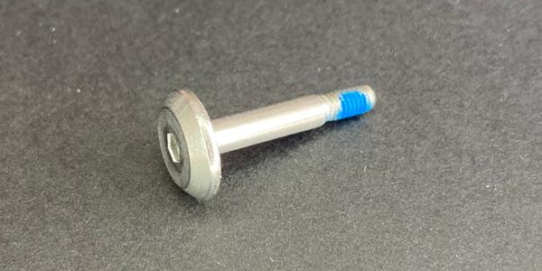
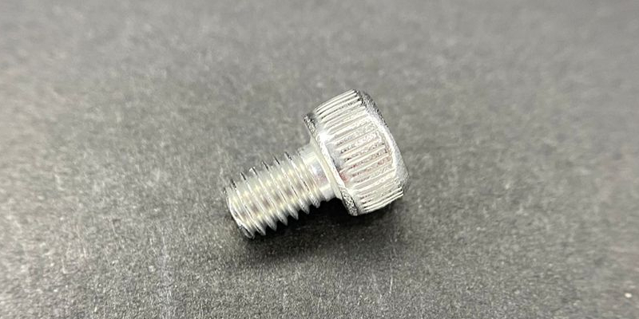
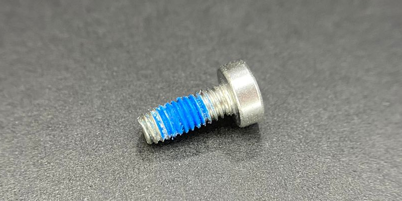
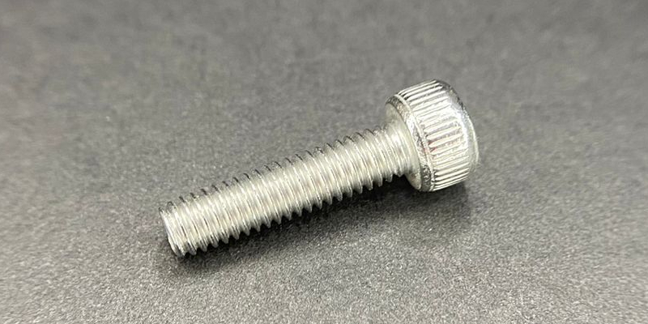

# Tornillos

| Imagen | Código & Descripción |
| ------ | -------------------- |
|  |YC.ST.LL000208  M2 x 6 mm Socket Head Screw for Motor Cover Tornillo M2 x 6 mm Cabeza Allen para Tapa de Motor |
|  |YC.WJ.LL000138  M2.5 x 4 mm Socket Head Screw for Centrifugal Spray Disks Tornillo M2.5 x 4 mm para Discos de Boquillas Centrífugas |
|  |YC.ST.LL000224  M2.5 x 5 mm Countersunk Head Screw for Impeller Pump and Centrifugal Motors Tornillo M2.5 x 5 mm Cabeza Avellanada para Motores de Bomba y Boquilla Centrifuga |
|  |YC.WJ.L01549  M2.5 x 8 mm Socket Head Screw for Radar and ESC Cables Tornillo M2.5 x 8 mm Cabeza Allen para los Cables de los Radares y de los ESCs |
|  |YC.WJ.L00870  M3 x 6 mm Socket Head Screw Tornillo M3 x 6 mm Cabeza Allen |
|  |YC.WJ.L00871  M3 x 10 mm Socket Head Screw Tornillo M3 x 10 mm Cabeza Allen |
|  |YC.ST.LL000226  M3 x 14 mm Flat Head Screw for CDB, PDB and/or Forward Vision Sensors Tornillo M3 x 14 mm Cabeza Plana para TDC, TDP y/o Sensores de Vision Frontal |
|  |YC.WJ.LL000213  M3 x 20 mm Flat Head Motor Cover Screw Tornillo M3 x 20 mm Cabeza Plana del Protector de Motor |
|  |YC.WJ.L00876  M4 x 6 mm Socket Head Screw Tornillo M4 x 6 mm Cabeza Allen |
|  |YC.WJ.LL000232  M4 x 10 mm Socket Head Screw Tornillo M4 x 10 mm Cabeza Allen |
|  |YC.ST.LL000013  M4 x 14 mm Socket Head Screw Tornillo M4 x 14 mm Cabeza Allen |
