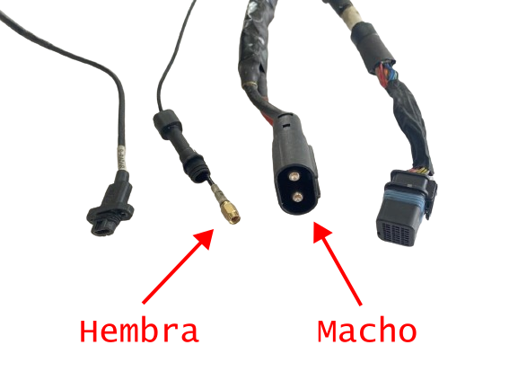
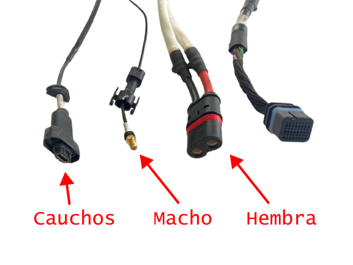

# Cables del Chasis

Lado Izquierdo...

Lado Derecho...

## Vista Delantera

Estos son los terminales del lado de la Tarjeta de Distribución de Cables. 

## Vista Trasera

Estos son los terminales del lado de la Tarjeta de Distribución de Potencia. 

