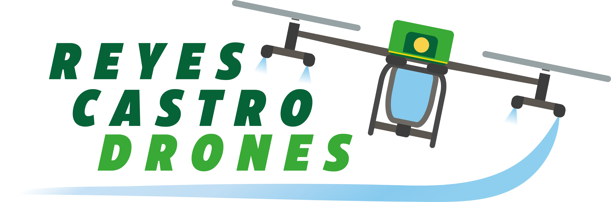

# DJI Agras T40: Diagnóstico y Resolución de Problemas _(Troubleshooting)_

A continuación se listan los errores del DJI Agras T40 clasificados por subsistema. 
* **Errores del Sistema de Vuelo y/o Propulsión:** Estos errores merecen la máxima prioridad dado que si no son atentidos el dron se puede accidentar.
* **Errores del Sistema de Rociado:** Estos errores pueden resultar en malas aplicaciones, pero generalmente no conllevan peligro de vuelo.

## Errores del Sistema de Vuelo
* No se puede despegar. Las antenas duales RTK no están listas.
* Fuente de señal RTK no seleccionada. No se puede iniciar.
* Desvío excesivo de barómetro
* Barómetro fuera de rango
* Cambio de la altitud estática de la aeronave
* Aeronave desvinculada
* Vinculación inestable, la aplicación no ha podido desbloquar la aeronave.
* La vinculación de la aeronave era anormal y no ha podido ser desbloqueada. Nunca despegue en el home mast...
* Error de radar. La detección de obstáculos podría no estar disponible. Ejecute el pilotaje y el aterrizaje manualmente.
* Radar desconectado
* Error de autocomprobación del ESC del radar
* ESC de radar desconectado
* Ha fallado la comunicación entre el radar y el sistema de navegación.
* Excepción de comunicación interna de radar I
* Excepción de comunicación interna de radar III
* Excepción de comunicación de bajada de radar I
* Excepción de comunicación de bajada de radar III
* Error de ráster de radar
* Excepción de reloj RF de radar
* Luz ambiental delantera demasiado débil. Sistema de superación de obstáculos no disponible. Vuele con cuidado.
* Sensores de visión binocular delanteros borrosos. La detección de obstáculos frontal no está disponible Asegúrese...
* Error de calibración del sensor visual frontal. El sistema de detección de obstáculos frontal no está disponible. Recalibrar sensor.
* Error de detección de obstáculos frontales. La función de superación de obstáculos puede no estar disponible.
* Error al inicial la posición del estabilizador
* Error de datos del motor del estabilizador
* Error al inicial el estabilizador. Sobrecarga de motor.
* Motor del estabilizador no inicializado
* El radio de la misión es superior al límite acceptable.
* Error al inicial el algoritmo de CNN. Re-inicie la aeronave o vuele con cuidado.
* El dron no ejecuta el RPO al finalizar la misión (a pesar de estar programado para hacerlo).
* El dron no ejecuta el RPO al acabar el líquido del tanque (a pesar de estar programado para hacerlo).
* El dron no ejecuta el RPO al llegar al nivel de batería baja (a pesar de estar programado para hacerlo).
* Versión del módulo Aeronave incompatible
* Su aeronave está en la zona restringida
* Aeronaves en zona de advertencia (0). Vuele con cuidado.
* Se ha detectado un error en el movimiento izquierdo y derecho de la palanca izquierda. No se puede...

## Errores del Sistema de Propulsión
* [Vibración anormal en los brazos del bastidor. Riesgo de choque. Se requiere mantenimiento inmediato.](./propulsion/vibracion-anormal.md)
* Se ha perdido el acelerador de repuesto del Motor 1. Detenga el vuelo inmediatamente.
* Se ha perdido el acelerador de repuesto del Motor 2. Detenga el vuelo inmediatamente.
* Se ha perdido el acelerador de repuesto del Motor 3. Detenga el vuelo inmediatamente.
* Se ha perdido el acelerador de repuesto del Motor 4. Detenga el vuelo inmediatamente.
* Se ha perdido el acelerador de repuesto del Motor 5. Detenga el vuelo inmediatamente.
* Se ha perdido el acelerador de repuesto del Motor 6. Detenga el vuelo inmediatamente.
* Se ha perdido el acelerador de repuesto del Motor 7. Detenga el vuelo inmediatamente.
* Se ha perdido el acelerador de repuesto del Motor 8. Detenga el vuelo inmediatamente.
* Error de autocomprobación del ESC 1
* Error de autocomprobación del ESC 2
* Error de autocomprobación del ESC 3
* Error de autocomprobación del ESC 4
* Error de autocomprobación del ESC 5
* Error de autocomprobación del ESC 6
* Error de autocomprobación del ESC 7
* Error de autocomprobación del ESC 8
* ESC 1 desconectado
* ESC 2 desconectado
* ESC 3 desconectado
* ESC 4 desconectado
* ESC 5 desconectado
* ESC 6 desconectado
* ESC 7 desconectado
* ESC 8 desconectado
* Excepción de ciclo de acelerador del motor 1
* Excepción de ciclo de acelerador del motor 2
* Excepción de ciclo de acelerador del motor 3
* Excepción de ciclo de acelerador del motor 4
* Excepción de ciclo de acelerador del motor 5
* Excepción de ciclo de acelerador del motor 6
* Excepción de ciclo de acelerador del motor 7
* Excepción de ciclo de acelerador del motor 8
* El brazo 1 no está bien sujeto (a pesar de estar asegurado)
* El brazo 2 no está bien sujeto (a pesar de estar asegurado)
* El brazo 3 no está bien sujeto (a pesar de estar asegurado)
* El brazo 4 no está bien sujeto (a pesar de estar asegurado)
* Error de voltaje de la batería
* Salida de batería demasiado alta. Aterrizaje forzoso en curso.
* Se requiere mantenimiento de la batería
* Sobrecalentamiento MOS de la batería
* Ha fallado la autenticación de la batería
* Error de comunicación entre el controlador de vuelo y la batería
* Error de comprobación automática de la batería. No despegue.

## Errores del Sistema de Rociado
* Error en sensor de nivel de líquido Hall de punto único
* Sensor de nivel de líquido Hall the punto único desconectado
* Cable de conexión del sensor de peso roto
* Marcado incorrecto del litraje del tanque
* [Error de cálculo de caudal de la bomba 1](./rociado/diagnostico-problemas-bombas.md)
* [Error de cálculo de caudal de la bomba 2](./rociado/diagnostico-problemas-bombas.md)
* [Error de cálculo de caudal de ambas bombas](./rociado/diagnostico-problemas-bombas.md)
* [Ha fallado la autocomprobación de la bomba 1](./rociado/diagnostico-problemas-bombas.md)
* [Ha fallado la autocomprobación de la bomba 2](./rociado/diagnostico-problemas-bombas.md)
* [Ha fallado la autocomprobación de ambas bombas](./rociado/diagnostico-problemas-bombas.md)
* [Excepción de tiempo de funcionamiento ESC de la bomba de agua 1](./rociado/diagnostico-problemas-bombas.md)
* [Excepción de tiempo de funcionamiento ESC de la bomba de agua 2](./rociado/diagnostico-problemas-bombas.md)
* [Excepción de tiempo de funcionamiento ESC de ambas bombas](./rociado/diagnostico-problemas-bombas.md)
* [Voltage de la bomba 1 demasiado bajo](./rociado/diagnostico-problemas-bombas.md)
* [Voltage de la bomba 2 demasiado bajo](./rociado/diagnostico-problemas-bombas.md)
* [Voltage de ambas bombas demasiado bajo](./rociado/diagnostico-problemas-bombas.md)
* [Bomba 1 no conectada](./rociado/diagnostico-problemas-bombas.md)
* [Bomba 2 no conectada](./rociado/diagnostico-problemas-bombas.md)
* [Ambas bombas desconectadas](./rociado/diagnostico-problemas-bombas.md)
* [Calibración de las bombas ha dado error en la bomba 1](./rociado/diagnostico-problemas-bombas.md)
* [Calibración de las bombas ha dado error en la bomba 2](./rociado/diagnostico-problemas-bombas.md)
* [Calibración de las bombas ha dado error en ambas bombas](./rociado/diagnostico-problemas-bombas.md)
* [Cabezal de boquilla desgastado o boquilla obstruida (boquilla centrífuga 1)](./rociado/cabezal-boquilla-desgastado.md)
* [Cabezal de boquilla desgastado o boquilla obstruida (boquilla centrífuga 2)](./rociado/cabezal-boquilla-desgastado.md)
* Boquilla centrífuga 1 Motor atascado
* Boquilla centrífuga 2 Motor atascado
* [Boquilla centrífuga 1 Error ESC](./rociado/diagnostico-problemas-boquillas.md)
* [Boquilla centrífuga 2 Error ESC](./rociado/diagnostico-problemas-boquillas.md)
* [Boquilla centrífuga 1 Fallo de comprobación automática ESC](./rociado/diagnostico-problemas-boquillas.md)
* [Boquilla centrífuga 2 Fallo de comprobación automática ESC](./rociado/diagnostico-problemas-boquillas.md)
* [Boquilla centrífuga 1 Voltaje demasiado bajo](./rociado/diagnostico-problemas-boquillas.md)
* [Boquilla centrífuga 2 Voltaje demasiado bajo](./rociado/diagnostico-problemas-boquillas.md)
* [Boquilla centrífuga 1 desconectada](./rociado/diagnostico-problemas-boquillas.md)
* [Boquilla centrífuga 2 desconectada](./rociado/diagnostico-problemas-boquillas.md)
* Excepción de puesta a cero del caudímetro
* [Caudimetro desconectado](./rociado/caudimetro-desconectado.md)
* Calibración del caudimetro ha dado error
* Caudimetro marca 0 litros por minuto a pesar de que las bombas están encendidas
* Caudimetro marca más de 12 litros por minuto
* Voltaje de carga del caudímetro demasiado alto
* Se ha superado la capacidad de carga. Asegúrese de que la carga especificada se encuentra dentro... (a pesar de que el dron tiene menos de 40 litros)
